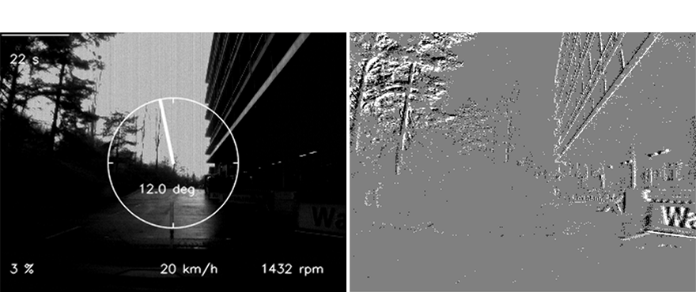
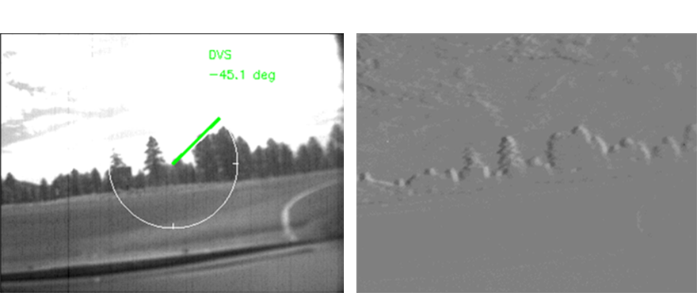

# Steering Prediction for Self-Driving Cars with Event-based Vision

This repository contains the scripts that support the thesis with title "Steering Prediction for Self-Driving Cars with Event-based Vision".

The deep learning approaches aim to unlock the potential of event cameras as well as fuse event and frame data for the prediction of an autonomous vehicle's steering angle.

#### Citations
The project is based on the following published work:

Maqueda, A. I., Loquercio, A., Gallego, G., García, N., & Scaramuzza, D. (2018). Event-based vision meets deep learning on steering prediction for self driving cars. In Proceedings of the IEEE conference on computer vision and pattern recognition (pp. 5419-5427).

Paper: [Event-based vision meets deep learning on steering prediction for self-driving cars](http://rpg.ifi.uzh.ch/docs/CVPR18_Maqueda.pdf)

GitHub page: https://github.com/uzh-rpg/cvpr18_event_steering_angle

## Introduction

Computer Vision is one of the highly important subfields of Artificial Intelligence, as it enables machines to analyze and interpret visual information presented in the form of video or image. In recent years, there has been a growing trend in the use of Event Cameras for implementing Computer Vision Algorithms. Event Cameras are biologically inspired sensors that respond to sudden brightness changes of a scene. Theses sensors are distinguished by their high dynamic range, high temporal resolution, low power consumption and high bandwidth, allowing each pixel to respond asynchronously and independently, providing high performance in both low and high illumination conditions with reduced blur. These advantages are proven to be beneficial in Autonomous Driving applications.


### Model

In this project, both Event Cameras and conventional Frame-based Cameras are utilized to implement a demanding motion estimation task, predicting the steering angle of an Autonomous Vehicle. (1) Initially, modern convolutional architectures are adapted to the output of Event Cameras, as well as conventional cameras, and are evaluated in large-scale datasets that include data from both types of sensors, The main goal of this network is to fully exploit the capabilities of the Event Cameras. Ultimately, it achieves an improved performance of up to 0.413 EVA in this specific application, compared to the conventional cameras. (2) Given the fact that intensity-based brightness sensors have certain limitations, such as information loss in the absence of vehicle motion, fusion network architectures in which the two types of inputs operate complementarily are proposed. This approach enhances the network’s performance by up to 0.016 EVA, compared to the single input-based approach. Thus, greater accuracy in predicting the steering angle is achieved under various illumination conditions.

### Data

The publicly available end-to-end datasets [DAVIS Driving Dataset 2017 (DDD17)](https://docs.google.com/document/d/1HM0CSmjO8nOpUeTvmPjopcBcVCk7KXvLUuiZFS6TWSg/pub) and [DAVIS Driving Dataset 2020 (DDD20)](https://sites.google.com/view/davis-driving-dataset-2020/home) are used for the prediction of the vehicle's steering angle. They include asyncronouse events as well as syncrhonous grayscale frames.






## Running the code

### Software requirements

This code has been tested on Ubuntu 18.04, and on: 
- Python 2.7 for data pre-processing, with the following dependencies:
    
    - OpenCV 4.1.0
    - H5Py 2.9.0
    - Matplotlib 2.2.2
    - SciPy 1.2.1
    - OpenXC 0.15.0
    - Tqdm 4.63.0

- Python 3.6 for training models, with the following dependencies:
  - single input models & fusion models with ResNet50 backbone network:
    - TensorFlow-GPU 1.11.0
    - Keras 2.1.6
    - OpenCV 3.4.2
    - H5Py 2.8.0
    - GFlags 3.1.2
    - NumPy 1.19.2
    - Matplotlib 3.3.4
    - SciPy 1.5.2
    - Scikit-learn 0.24.2
    - Unipath 1.1
  - fusion models with ResNet34 backbone networks:
    - TensorFlow-GPU 1.12.0
    - Keras 2.2.4
    - OpenCV 3.4.2
    - H5Py 2.8.0
    - GFlags 3.1.2
    - NumPy 1.19.2
    - Matplotlib 3.3.4
    - Scipy 1.5.2
    - Scikit-learn 0.24.2
    - Unipath 1.1

### Data preparation

Follow the instructions from the [DDD17 site](https://docs.google.com/document/d/1HM0CSmjO8nOpUeTvmPjopcBcVCk7KXvLUuiZFS6TWSg/pub) and [DDD20 site](https://sites.google.com/view/davis-driving-dataset-2020/home), to download the dataset and visualize the HDF5 file contents. After that, you should get the following structure:

```
DDD17/
	run1_test/
	run2/
	run3/
	run4/
	run5/
```

Authors also provide some [code](https://code.ini.uzh.ch/jbinas/ddd17-utils) for viewing and exporting the data. Download the repository and copy the files within the ```data_preprocessing``` directory.

Asynchronous events are converted into synchronous event frames by pixel-wise accumulation over a constant time interval, using separate channels for positive and negative events. To prepare the data in the proper format run the bash script  ``data_preprocessing/.sh``.


